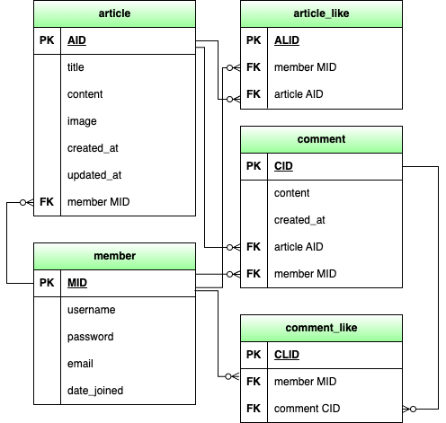

<h3>📚 Tech Stack 📚</h3>

	
	
	
	
	
	
	

# 프로젝트 소개
스파르타 뉴스 API 서버를 DRF로 구현

# 쉽죠? 팀소개
김동용(팀장),정성원(서기), 김나현(멤버), 임선오(멤버)

# 프로젝트 주요기능

accounts

- 회원가입
- 로그인(RefreshToken 발급)
- 회원 프로필 조회
- 회원 정보 수정
- 로그아웃(TokenBlacklist 추가)
- 회원탈퇴

articles

- 뉴스 목록 조회(메인페이지)

- 뉴스 작성
- 뉴스 상세페이지 조회
- 뉴스 수정
- 뉴스 삭제

- 댓글 작성
- 댓글 조회
- 댓글 수정
- 댓글 삭제

- 뉴스 좋아요
- 댓글 좋아요

- 뉴스 url 입력시 뉴스 내용 요약하는 ai 기능
- 네이버 야구 뉴스 크롤링 후 뉴스 목록 제공(클릭시 본문 이동)
- 뉴스목록 크롤링 후 목록 제공 (클릭시 기사내용 요약 제공)

- 회원이 작성한 뉴스 조회
- 회원이 좋아요한 뉴스 조회
- 회원이 좋아요한 댓글 조회

# 개발 기간
9/11 ~ 9/19

# 기술 스택
- Django
- Django REST Framework (DRF)
- SQLite3
- Google
- PyCharm
- VS Code
- Python
- GitHub

# ERD

# 와이어 프레임

# API 명세서
[API 명세서 조회] (https://www.notion.so/68400ebc525049998368d7c0059d9393?pvs=21)

# 트러블 슈팅

- related_name이 충돌 됬을때 발생하는 에러이다
	-  해결: .Models에서 각 model을 확인하여 related_name을 겹치지 않게 다시 정의하여 해결하였다 

- article_pk라는 필드명을 사용했지만, Article 모델에 article_pk라는 필드가 존재하지 않아서 발생한 오류이다.
  

	- 해결: Django는 모델에서 자동으로 id 필드를 생성하므로 article_pk 대신 pk나 id로 변경하여 해결하였다.

- git repositories 작성 후 최초 push 할때 소통문제로 인해 SECRET_KEY가 들어있는 파일도 함께 git에 올라감
  
    
	- 해결: repositories를 제거 후 다시 시작
   
- 웹크롤링시 크롬 드라이버 를 사용 해야했는데 브루로 설치했더니 크롬 드라이버 설치경로가 브루로 되어있었고 selenium 을 사용하려면 chromedraver 같은 위치에 있어야 해서 사용이 되지않았다
	- selenium 의 chromeservice 를 사용해서 경로 지정 해주었고 사용할수 있게 되었다
   
- 크롬드라이버 사용시 크롬 브라우저 버전과 일치 하지 않아 시용이 안되는것을 확인
	- 크롬 드라이버는 최신 버전이였고 크럼 브라우저는 한단계 낮은 버전이라서 브라우저 업데이트 하여 문제 해결
   
- openai 사용시 키를 settings 에 넣어주어야 하는데 이그노어 하기 위해 config_key 파일을 만들어 키을 넣어주었다 팀원들이 이그노어 되어 있어서 확인하지 못하는 문제가 생겼고
	- 이것은 소통의 문제라 이그노어 파일 명을 서로 맞추고 추가하는 것으로 해결

- 소셜로그인을 시도 하였고 구글 로그인 성공까지 하였으나 우리가 사용하던 permission과 맞지 않아
  로그인 하여도 권한을 받지 못하는 문제가 발생
  
	- 시간적 한계로 문제 해결지 못하여 소셜 로그인은 머지 하지않음
